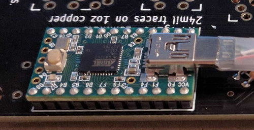

Now the section where the soldering and real assembly happens, in the next subsection there will be a couple external links to other build guides including both a photo and video build log.

1. Arrange the pcbs face down and solder in the diodes to this side.
  * 1a. If _surface mount_ diodes are chosen, place them on the small square copper pads but be sure to orient the diodes so that the line on the diode faces the square hole. Solder the diodes and repeat for each switch on both hands.
  * 
  * 1b. If _through hole_ diodes are chosen, place them through the two hole immediately to the left and right of copper pads under the square that the switch will take up. Be sure to check the orientation to be sure that the line on the diode is closest to the square hole. Solder and repeat for each switch on both hands.
  * 
~~~    
	Note: The additional holes in this second image are for through switch LEDs. Only one diode per switch is needed.
~~~

2. Flip both of the pcbs over, this face up side (without the diodes) will be the side that the remaining components will be placed.

3. Insert both the 2.2k ohm resistors and 220 ohm (or whatever resistors chosen appropriate for the leds selected) onto the right hand where labled on the pcb and solder into place. 
~~~
Note: Keep the legs clipped off the resistors, they can be used in a later step when the TRRS connections are installed.
~~~

4. On the left hand pcb, insert the I/O expander around the MCP23018 rectangle. The I/O expander is directional and the notch on the I/O expander should match up with the silkscreen. The notch on the expander will be facing ErgoDox printing on the circuit board. See the image in the next step for an example.
~~~
Note: There are three holes without copper pads and do not need to be soldered.
~~~

5. _(Optional but suggested step)_ On the left hand pcb, insert the ceramic capacitor into the first and third holes of the top row and solder in place.
 * 5a. Bridge with solder the two copper pads immediately to the left of the ceramic capacitor.
 * 

6. Insert either jumper wire or the legs clipped from the resistors bent into a U, into both of the the white pairs of holes on either side of where the 3.5mm connections will go and solder in place.
 * 6a. Place 3.5mm connection, solder the 4 connection points.
 * 6b. Repeat both the jumper and 3.5mm connectors on the other hand.
 * 

7. Install the male jumper pins to the underside of the Teensy with the button face up and solder the pins to the top side of the Teensy.
~~~
Note: If the Teensy already has jumpers already installed, skip this step.
~~~

8. Insert the Teensy jumper legs from the Teensy assembly onto the right hand pcb with the usb facing the direction of the resistors and solder in place.
 * 

9. Cut one of the mini usb cables about 1.5" from the connector.
 * 9a. Strip off all of the sheathing from the cable, exposing the 4 wires.
 * 9b. Place the following wires into their respective holes:
~~~   
White: D-
Red:   5v
Green: D+
Black: GND
~~~
 * 9c. Solder wires to the pcb.
 * 

10. On the right hand, insert the mini usb connector into the holes marked on the pcb and solder into place.
 * 

11. Prepare the chosen case.
 * 11a. If the layered acrylic case design is being used, peel off the protective film off the acrylic pieces. 
   * Place the pcb under the 3rd acrylic layer and insert the switches into the acylic plate making sure that both pins from the switch are extending out through the pcb.
 * 11b. If the 3D printed case is being used
   * Place the pcb under the top section and push the switches into the case making sure that both pins from the switch are extending out through the pcb.
 * 11c. Solder switches in place.
~~~
Note: Make note of the location for the three switches on the right hand that will support the LEDs
~~~
  
12. On the right hand, insert the three leds through the housing of the three switches and solder into place.
~~~
Note: LEDs have polarity so be sure that the positive leg of the LEDs goes into the (face up) square hole.
~~~
	
13. Finish assembling the case, plug in the TRRS cable between the two halves and proceed to building and flashing the selected firmware.

