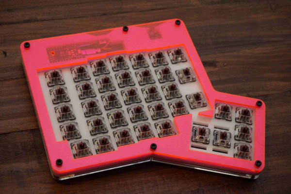
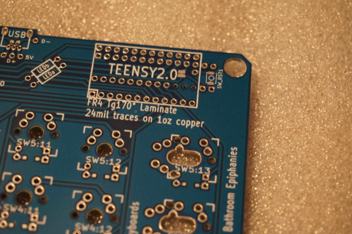
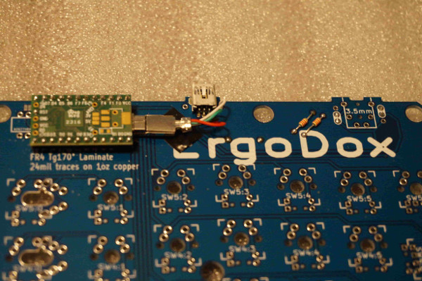
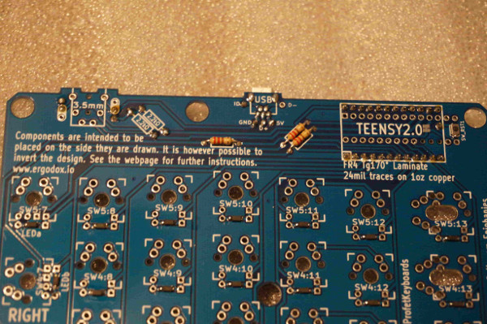

User Profet23 of [profetkeyboards.com](http://profetkeyboards.com) has made some pcb updates that have been merged into the main pcb repo to allow for left hand only ErgoDox support. This is ideal as a gamepad or other single left-handed usage.

An example of the a finished build

The PCB has now has pads that support the installation of an optional reset switch. The Teensy 2.0 is actually installed upside down, the built in reset switch is not accessible. There is also an extra hole for the Teensy to solder a header pin for the reset switch. 

The new "top" of PCB. Teensy is installed upside down. 2.2k resistors, jumpers, and USB port installed on top. In this revision of the PCB, the jumpers dictate which side the USB port can be installed on as well as the TRRS port (which isn't used in gamepad configuration). 
~~~
	Note: that the USB connection wires are installed (from left to right) empty, black, green, red, white. This is different from the silk screen layout as the usb port is now on "backwards".
~~~

The new "bottom" of the PCB. The reset switch has been soldered to the bottom. LED resistors have also been soldered to bottom.

